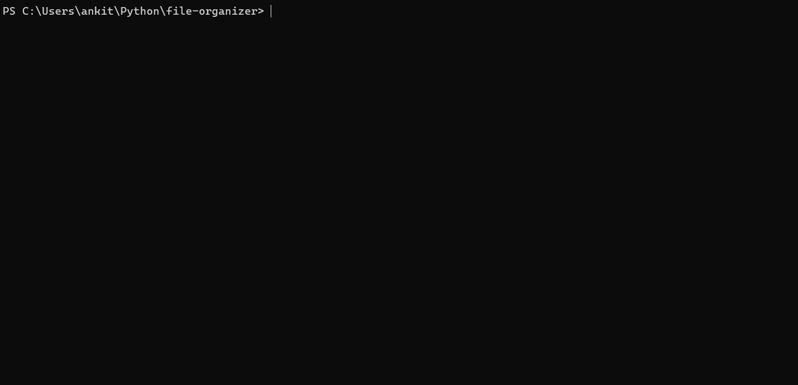

<!-- Centered Banner -->

  

# Ankit Anathula  
**Computer Science Student @ UAH**  
📍 Huntsville, AL • 📧 [ankitanathula@gmail.com](mailto:ankitanathula@gmail.com)  
🔗 [LinkedIn](https://www.linkedin.com/in/ankit-anathula-86a56317a/) | [GitHub](https://github.com/ankitanathula)

---

## 🧰 What I Do  
- Build Python CLI tools to automate workflows and organize data  
- Practice DevOps basics (CI/CD, caching, linting, coverage)  
- Currently learning C++ (working through pointers; structs coming soon)  
- Completed Codecademy’s Python 3 course (100%) + CS 104 @ UAH (99%)

---

## 🚀 Projects  

### 📂 File Organizer  
A Python CLI tool that:  
- Sorts and groups files by type or date  
- Batch-renames and moves 10,000+ files in seconds  
- Uses YAML/JSON for configuration

**Tech:** Python 3 · `argparse` · `os` · `logging`  
🔗 [GitHub Repo](https://github.com/ankitanathula/file-organizer)  

---

## 🛠️ Skills  
- **Languages:** Python · C++ (pointers in progress) · R (basic clustering) · SQL (basic querying)  
- **Concepts:** Object-Oriented Programming • Constructors • `__repr__` • File I/O • DevOps Basics
- **Tools:** Git · GitHub · CLI scripting · Unit testing · CI workflows

---

## 💼 Contact  
  
✉️ ankitanathula@gmail.com
